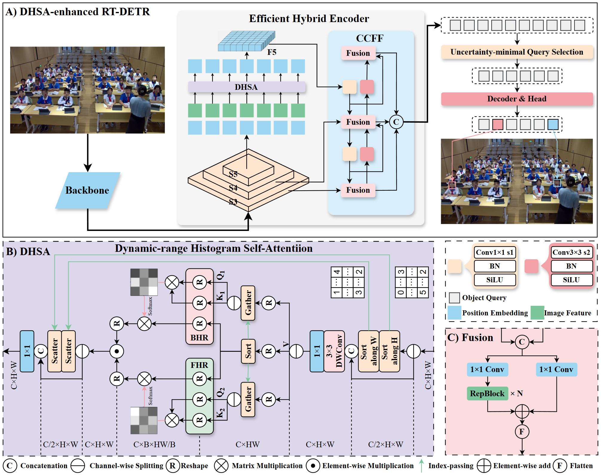

# DHSA-Enhanced RT-DETR for Classroom Behavior/Expression Analysis

English | [中文](./README.md)

This repository contains the model-side implementation and experiment artifacts for the manuscript on classroom multimodal learning analytics.

The key contribution is a DHSA-enhanced RT-DETR detector used for student behavior and expression analysis in classroom videos.

## Core Contribution

### What is improved over baseline RT-DETR

- The baseline RT-DETR encoder is enhanced with **Dynamic-range Histogram Self-Attention (DHSA)**.
- DHSA is adapted from Histoformer and integrated into the RT-DETR backbone/encoder path.
- This design targets stronger feature representation under classroom conditions (small targets, clutter, varied illumination).

### Where to inspect the DHSA implementation

- Main DHSA module: `ultralytics/nn/extra_modules/transformer.py`
- Relevant model construction path: `ultralytics/nn/tasks.py`
- RT-DETR model configs: `ultralytics/cfg/models/rt-detr`

Original DHSA reference:
- [Histoformer](https://github.com/sunshangquan/Histoformer)

### Architecture figure

## Reproducibility Evidence

### Dataset config files

- `dataset/action-1-721.yaml` (behavior task)
- `dataset/exp-1-721.yaml` (expression task)

Raw classroom data is not publicly released for privacy and ethics reasons.

### Training/evaluation logs included

- `runs/train/.../results.csv`
- `runs/train/.../args.yaml`

These files provide training arguments and metric curves used in the manuscript experiments.

## Inference Test Script (engineering supplement)

For practical testing, this project includes:

- `classroom_dual_model_sampler.py`

Pipeline:
- Stage 1: person detection on full frame.
- Stage 2: crop each person box and run behavior + expression classification.
- Sampling once every 30 frames (configurable).
- Aggregate class percentages every 30 seconds (configurable).
- Optional per-sampled-frame person-box visualization output.

Testing guides:
- Chinese: `TESTING_GUIDE_CN.md`
- English: `TESTING_GUIDE_EN.md`

## Note to Reviewers

This repository is based on the Ultralytics framework and keeps the modified model implementation plus experiment evidence for method verification.
The emphasis is on DHSA integration and reproducibility artifacts, while private raw classroom data remains unavailable.
